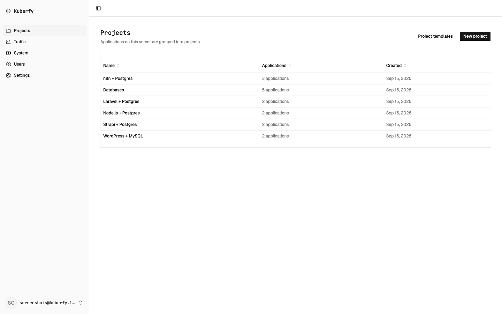
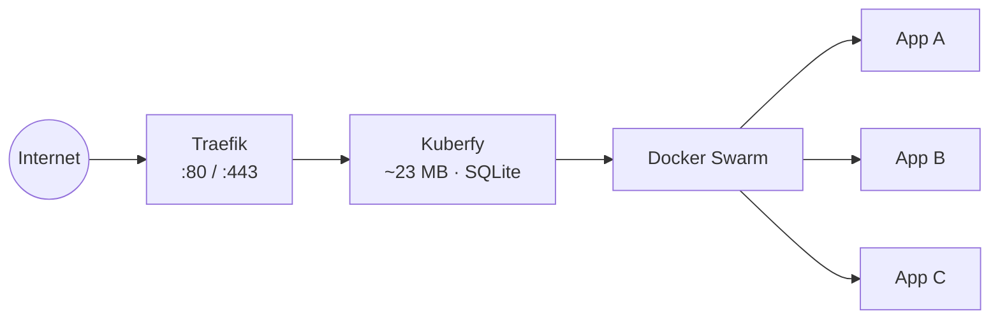

# Kuberfy

[](https://github.com/JoelVeloz/kuberfy/actions/workflows/publish.yml)
[](LICENSE)

**The lightest self-hosted alternative to Heroku, Vercel, and Netlify.**

```bash
curl -sSL https://kuberfy.pages.dev/install.sh | sudo sh
```

[kuberfy.pages.dev](https://kuberfy.pages.dev)



## Comparison

|                  | Dokploy         | Coolify               | CapRover  | Kuberfy             |
| ---------------- | --------------- | --------------------- | --------- | -------------------- |
| Min RAM          | 2 GB            | 2 GB                  | ~1 GB     | **1 GB**             |
| Database         | Postgres        | Postgres + Redis      | —         | **SQLite (embedded)**|
| Proxy            | Traefik         | —                     | Nginx     | Traefik              |
| Orchestration    | Swarm           | Compose               | Swarm     | Swarm                |

## Features

- Deploy from Git or a Docker image
- Automatic HTTPS (Traefik + Let's Encrypt)
- Projects, custom domains, deploy history & logs
- Email/password auth with roles
- One-command install, update, uninstall

## Requirements

| Resource | Minimum | Recommended |
| --- | --- | --- |
| OS | Ubuntu 22.04+ / Debian 12+ (x86_64 or arm64) | Ubuntu 24.04 LTS |
| CPU | 1 vCPU | 2+ vCPU |
| RAM | 512 MB | 1 GB+ |
| Disk | 5 GB SSD | 10 GB+ SSD |
| Ports | `80`, `443` | `80`, `443` |

Runtime footprint: **~23 MB** (API) + **~14 MB** (Traefik).

## Commands

| Action | Command |
| --- | --- |
| Install | `curl -sSL https://kuberfy.pages.dev/install.sh \| sudo sh` |
| Update | `curl -sSL https://kuberfy.pages.dev/update.sh \| sudo sh` |
| Uninstall | `curl -sSL https://kuberfy.pages.dev/uninstall.sh \| sudo sh` |

## Architecture



| Path | Stack |
| --- | --- |
| `apps/api` | Bun · Hono · Drizzle · SQLite |
| `apps/web` | Astro · React · Tailwind |
| `apps/landing` | Astro (static) |

## License

[BUSL 1.1](LICENSE) → converts to Apache 2.0 on 2030-09-13. Free to self-host and build on.

## Contributing

Issues and PRs welcome.
