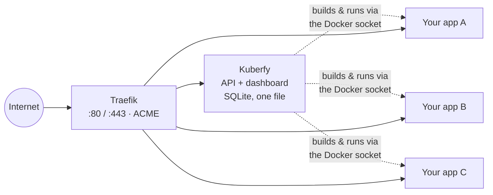

# Kuberfy

**The lightest self-hosted PaaS.** Deploy applications from a Git repository or a Docker image, get automatic HTTPS, and manage everything from a single web dashboard — running on a footprint small enough for a $5/month VPS.

Kuberfy exists because most self-hosted deployment platforms ship a Postgres server, a Redis instance, and a full Node runtime just to manage a handful of containers. Kuberfy doesn't. The whole control plane — API, dashboard, and database — compiles down to a single static binary and an embedded SQLite file, packaged in an Alpine image with no separate services to run, patch, or back up.

```
curl -sSL https://raw.githubusercontent.com/JoelVeloz/kuberfy/main/install.sh | \
  ADMIN_EMAIL=admin@example.com sh
```

## Why it's lighter

|                  | Typical self-hosted PaaS | Kuberfy                                                    |
| ---------------- | ------------------------ | ---------------------------------------------------------- |
| Database         | Postgres server          | Embedded SQLite (no separate service)                      |
| Runtime          | Node.js / interpreted    | Compiled binary ([Bun](https://bun.sh))                    |
| Base image       | `node:slim` or similar   | Alpine (~5 MB base)                                        |
| Extra services   | Redis, queue workers     | None                                                       |
| Networking / TLS | Manual or bundled proxy  | [Traefik](https://traefik.io) with automatic Let's Encrypt |
| Orchestration    | Custom agent             | Docker Swarm (built into Docker itself)                    |

Fewer moving parts means fewer things to monitor, fewer things to update, and less RAM sitting idle on a server whose only job is running your apps.

## Features

- **Deploy from Git or from an image** — point Kuberfy at a repository and Dockerfile, or at an existing image; it builds (or pulls) and runs it.
- **Projects and applications** — group related services under a project, each with its own applications, domains, and deployment history.
- **Automatic HTTPS** — every application gets a Traefik route and a Let's Encrypt certificate with no manual configuration.
- **Deployment history and logs** — every deploy is recorded with its status and full build/run output.
- **Custom domains** — attach one or more domains to an application independently of the deploy pipeline.
- **Authentication and roles** — email/password login with an admin role, backed by [Better Auth](https://www.better-auth.com).
- **One-command install** — a single script provisions Docker, Swarm, Traefik, and Kuberfy on a fresh Linux server.

## Requirements

Kuberfy's installer targets a single Linux server. Minimum specs:

- **OS**: Linux (x86_64 or arm64) — the installer refuses to run on macOS or inside a container
- **CPU**: 1 vCPU
- **RAM**: 512 MB (1 GB recommended if you'll run several applications alongside Kuberfy)
- **Disk**: 1 GB free, plus space for your application images
- **Access**: root shell
- **Software**: `curl`, `git`; Docker is installed automatically if missing
- **Network**: ports 80, 443, and 3000 free; a domain name if you want a public hostname (Let's Encrypt requires it — an IP works for local/internal use)

## Installation

The command above is the whole install. A few of its inputs are worth knowing about:

| Variable         | Required | Description                                                                                                    |
| ---------------- | -------- | ---------------------------------------------------------------------------------------------------------------- |
| `ADMIN_EMAIL`    | yes      | Email for the first admin user, created automatically on install                                                  |
| `KUBERFY_IMAGE`  | no       | Image to pull (default: `ghcr.io/joelveloz/kuberfy:latest`, built for both `amd64` and `arm64`)                   |
| `KUBERFY_REPO`   | no       | Git URL to build the image from instead of pulling — for testing unreleased changes                               |
| `KUBERFY_DOMAIN` | no       | Public domain routed to Kuberfy via Traefik (defaults to the server's IP, no TLS)                                 |
| `ACME_EMAIL`     | no       | Email used for Let's Encrypt certificates (defaults to `ADMIN_EMAIL`)                                             |
| `ADVERTISE_ADDR` | no       | Override automatic IP detection for `docker swarm init`                                                           |

Under the hood, the script installs Docker if it's missing, initializes a single-node Docker Swarm, creates an overlay network, pulls the Kuberfy image (or builds it from `KUBERFY_REPO` if set), and starts Kuberfy and Traefik as services. When it finishes, it prints the URL to open and the admin account it created. The published image is a multi-arch manifest (`amd64` + `arm64`), so the same command works on a standard x86_64 VPS or an ARM-based server (Oracle Cloud's ARM tier, AWS Graviton, Apple Silicon for local testing) without any extra flags.

For local development instead of a real server, copy `.env.example` to `.env` and run `docker compose up --build` — the same image, without Swarm.

## Architecture



Traefik terminates TLS at the edge and forwards to Kuberfy and to every deployed application. Kuberfy holds all state in a single SQLite file and drives Docker directly to build, run, and monitor your applications — there's no separate scheduler or message queue in between.

The repository is a small monorepo of independent Astro/Bun workspaces:

- **`apps/api`** — the control plane. [Hono](https://hono.dev) on [Bun](https://bun.sh), talking to Docker (`dockerode`) to build images, run containers, and track deployment status, with [Drizzle ORM](https://orm.drizzle.team) over SQLite. Compiled ahead of time into standalone binaries (`bun build --compile`) — the production image ships no Node/Bun runtime, just those binaries on Alpine.
- **`apps/web`** — the dashboard. [Astro](https://astro.build) with React islands, Tailwind CSS, and shadcn/ui, built to static assets and served by the API.
- **`apps/landing`** — the public marketing site, a separate static Astro project with no dependency on the dashboard.

## Development

Requires [Bun](https://bun.sh) and Docker. Install dependencies once from the repo root with `bun install`, then `bun run dev` inside `apps/api` (after `bun run db:migrate`) or `apps/web`. Format and lint with `bunx prettier --write .` and `bunx oxlint .` before committing.

## Status

Kuberfy is under active development. The core deployment flow (projects, applications, Git/image-based deploys, domains, HTTPS) is functional; database provisioning, one-click templates, and multi-node management are on the roadmap.

## Contributing

Issues and pull requests are welcome at [github.com/JoelVeloz/kuberfy](https://github.com/JoelVeloz/kuberfy).
